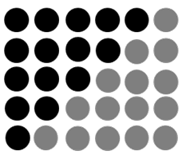

算法分析

---

在第五章中

### 选择排序

算法分析领域的一个经典问题就是**排序**问题。排序就是将一个数组中的元素重新进行排列，使得它们依照一个规定的顺序排列。例如，假设我们有一个名为 `arr` 的数组：

### 时间复杂度

### 递归的终止

### 算法复杂度的讨论

### 快速排序算法

### 数学归纳法

我们相信这样一个事实：以下的求和公式

$$N + N - 1 + N - 2 + ... + 3 +2 + 1$$

可以简化成更便于处理的公式：

$$ \frac{N^2+N}{2} $$

我们该如何来证明这个简化公式是正确的呢？

事实上，这里有几种不同的你可以尝试使用的证明方法。其中一种可能就是以几何形式来表达这个原始的求和过程。例如，假设  $$N = 5$$ ，然后将求和表达式中的每一项表示一个原点，这些圆点形成了以下三角形：

如果你拷贝这个三角形并对其进行旋转，那么这两个三角形的组合形成了一个矩形，下图用灰色表示了下面的三角形：

由于这个图案现在是一个矩形，其总的圆点数（包括黑色以及灰色）很容易计算。在这张图中，总共有五行，并且每一行都有六个圆点，所以这两种颜色的圆点总数就是 $$5 \times 6$$，也就是 $$30$$。

$$ \frac{N \times (N + 1)}{2} ​$$

$$ N + N - 1 + N - 2 + ... + 3 + 2 + 1 =  \frac{N \times (N + 1)}{2}  $$

$$ N + N - 1 + N - 2 + ... + 3 + 2 + 1 =  \frac{N \times (N + 1)}{2}  $$

$$ 1 = \frac{1 \times (1 + 1)}{2} = \frac{2}{2} = 1 $$

$$ N + N - 1 + N - 2 + ... + 3 + 2 + 1 =  \frac{N \times (N + 1)}{2}  ​$$

$$ N + 1 + N + N - 1 + N - 2 + ... + 3 + 2 + 1 =  \frac{(N + 1) \times (N + 1)}{2}  ​$$

$$ N + 1 + \frac{N \times (N + 1)}{2} $$

$$ N + 1 + \frac{N \times (N + 1)}{2} $$

$$ = \frac{2N + 2}{2} + \frac{N^2 + N}{2} $$

$$ = \frac{N^2+3N+2}{2} $$

$$ = \frac{(N + 1) \times (N + 1)}{2} $$

